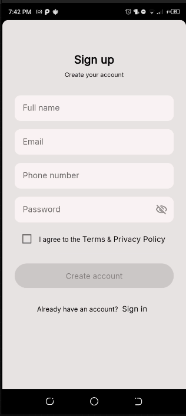
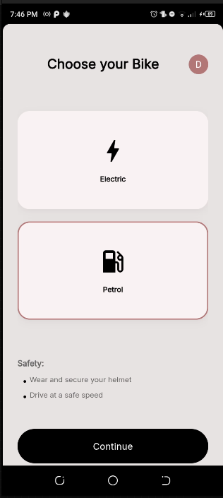
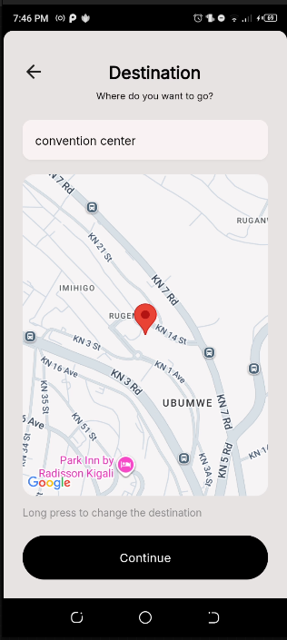
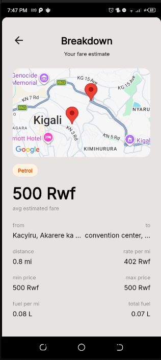
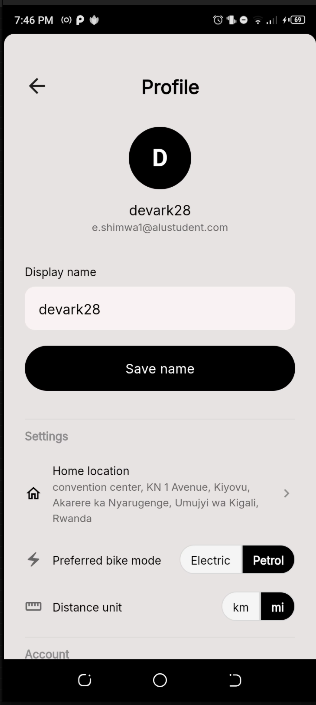

# Bikalk

Bikalk is an Android app that gives motorcycle passengers and riders in Kigali a data-driven fare
estimate before they negotiate. It calculates a suggested fare range using real-time route distance
and current energy costs for both petrol and electric motorcycles, helping reduce the pricing
friction and identity-based fare discrimination that affects daily commuters in the city.

---

## Screenshots

| Sign In | Sign Up | Home |
|---------|---------|------|
|  |  |  |

| Destination Search | Price Breakdown | Profile & Settings |
|--------------------|-----------------|-------------------|
|  |  |  |

---

## Setup

**Prerequisites**
- Flutter 3.x
- Android emulator or physical Android device

```bash
# 1. Clone the repo
git clone https://github.com/mad-g3/bikalk.git
cd bikalk

# 2. Install dependencies
flutter pub get

# 3. Ensure an Android device is connected or an emulator is running
flutter devices

# 4. Run the app
flutter run
```

Firebase is pre-configured — `google-services.json` and `lib/firebase_options.dart` are committed.
No additional Firebase setup is needed to run the app.

---

## Documentation

| Doc                                                      | What it covers                                                                                 |
|----------------------------------------------------------|------------------------------------------------------------------------------------------------|
| [Architecture](docs/architecture.md)                     | Layered architecture overview, ASCII diagram, dependency rules, how errors flow, why GetIt     |
| [Feature Structure](docs/feature_structure.md)           | What goes in `application/`, `presentation/`, `domain/`, `data/` and each of their sub-folders |
| [Decoupled Architecture](docs/decoupled_architecture.md) | Feature slices, example flows (auth, fare, reporting), rules of thumb                          |
| [Tools & Technologies](docs/tools_and_technologies.md)   | Every package used and why                                                                     |

---

## Project structure

```
lib/
  app/          # Bootstrap — DI, router, theme
  core/         # Shared utilities, widgets, error types
  features/     # One folder per feature, each with the same 4-layer structure
    auth/             # Sign-in, sign-up, email verification, password reset
    homeScreen/       # Bike mode selection (petrol vs electric)
    current_location/ # Origin picker with GPS and search
    destinationLocation/ # Destination picker with search
    price_breakdown/  # Fare range calculation and breakdown
    profile/          # User profile, settings, account actions
    report_problem/   # Problem reporting (CRUD)
    feedback/         # Feedback submission
```

Start with [Feature Structure](docs/feature_structure.md) if you're adding a new feature,
and [Architecture](docs/architecture.md) if you want to understand how the layers connect.
